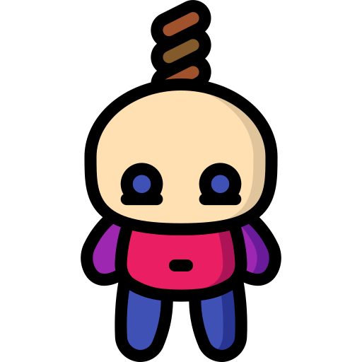

<center>
<h1>Hangman</h1>


</center>

## _**Rules**_
- It is a word guessing game where you need to build a missing word by guessing one letter at a time.
- You will get 5 chances to guess the word.
- If you guessed the correct character, then that character will be revealed.
- If you guessed the wrong character, then you number of attempts will decrease.
- After 5 incorrect guesses, the game ends and then, you will be hanged😜


# Steps to Run This Project Locally
1. Clone this repo in your machine.
    ```
    git clone https://github.com/brainless-coder/Hangman.git
    ```
2. Go to Project Directory.
    ```
    cd Hangman
    ```

3. Open `index.html` in your browser to play the game.
4. If you want to modify something, then `open this folder` in your favourite `code editor` and do the changes.

# Screenshots

<center>


</center>
